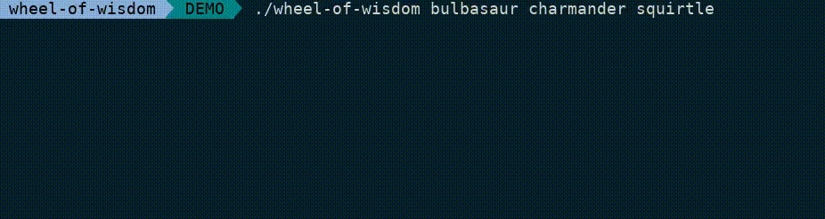
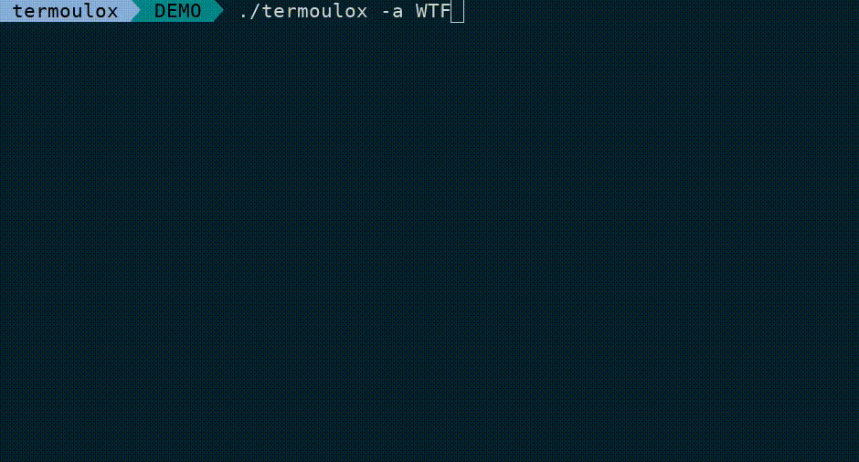

Terminul
========

**A collection of silly scripts that utilize terminal capabilities.**

There are currently **2** scripts in the collection:

* [Wheel of Wisdom](#wheel-of-wisdom) - Make bad decisions
* [Termoulox](#termoulox) - Say bright things

Wheel of Wisdom
---------------

**Make important (and often bad) decisions so that you don't have to.**

```
./wheel-of-wisdom bulbasaur charmander squirtle

cat pokemon_starters.txt | ./wheel-of-wisdom
```



> The wheel stops when the choice is made, but you can interrupt it by pressing
  any key.

For convenience, consider adding `wheel-of-wisdom` as an alias:

```
alias wow="/path/to/wheel-of-wisdom"
```

Termoulox
---------

**Display colorful messages in the terminal.**

```
./termoulox -a "Seriously WTF"

cat important.txt | ./termoulox
```



> Termoulox can be interrupted by pressing any key or with Ctrl+C

Usage:

```
 options (to combine with a mode or a text):
-a         Display text in ASCII art using figlet

 modes:
balec      Option from french speaker to express that you don't give a f*ck
	   Inspiration: Mr. Yeye - On s'en bat les couilles (video clip)

 other arguments:
Any other argument will be printed as text in termoulox.
```